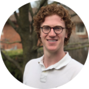

# Home

## About Me

I am a results oriented professional with an interest in robotics
and software development.  Currently I work as a a Cloud Application
Architect with AWS.  I completed a MASC with a focus an
artificial intelligence at the University of Guelph.  Through my prior work
experiences, B.ENG and MASC+AI degrees I have become great at working both
independently and in teams in a variety of work environments.  In my free
time I play the piano, study chess, work on programming projects, and try to
learn new programming concepts.

## Navigating this Site

Use the hamburger menu on the top left of the site to navigate
amonst the various pages.
